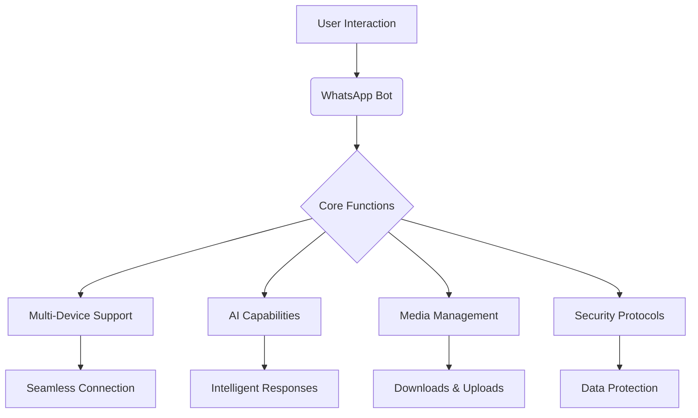

<div align="center">


# ⚡ ELITECHWIZ-V4 // NEURAL_NETWORK_ACTIVATED ⚡
  
<p align="center">
  
</p>

<div align="center">
  
  
  
  <br>
  
  
  
</div>

<br>


</div>



---

## 💠 ABOUT_SYSTEM // ELITECHWIZ_PROTOCOL

```yaml
version: 4.0.0
status: active
platform: Node.js
architecture: multi-device
capabilities:
  - real-time automation
  - secure communication
  - media processing
  - interactive modules
  - AI-driven responses
```

EliTechWiz-V4 is an advanced WhatsApp automation framework, engineered for precision and reliability. Operating on a robust Node.js foundation, it facilitates seamless interactions across multiple devices. Its core design emphasizes unparalleled speed, fortified security, and intelligent, adaptable functionality, ensuring optimal performance 24/7 within the WhatsApp ecosystem.

---

## ⚙️ DEPLOYMENT_SEQUENCE // INITIATE_INSTALLATION

<div align="center">
  <details>
    <summary><b>[ >> CLICK TO REVEAL << ] [ACCESS] Installation Protocols</b></summary>
    <br>
    <table>
      <tr>
        <th>PHASE</th>
        <th>OPERATION</th>
        <th>ACCESS_POINT</th>
      </tr>
      <tr>
        <td><code style="color: #00FF00;">01</code></td>
        <td><b>FORK_REPOSITORY</b></td>
        <td>
          <a href="https://github.com/Eliahhango/EliTechWiz-V4/fork">
            
          </a>
        </td>
      </tr>
      <tr>
        <td><code style="color: #00FF00;">02</code></td>
        <td><b>GENERATE_PAIRING_CODE</b></td>
        <td>
          <a href="https://pairingsite-a5bc23ed8b1e.herokuapp.com/pair">
            
          </a>
        </td>
      </tr>
      <tr>
        <td><code style="color: #00FF00;">03</code></td>
        <td><b>SCAN_MATRIX_FOR_CONNECTION</b></td>
        <td>
          <a href="https://pairingsite-a5bc23ed8b1e.herokuapp.com/eliahqr">
            
          </a>
        </td>
      </tr>
    </table>
  </details>
</div>

---

## ☁️ CLOUD_INTEGRATION // HEROKU_DEPLOYMENT

<div align="center">
  <details>
    <summary><b>[ >> CLICK TO REVEAL << ] [EXECUTE] Cloud Deployment Protocols</b></summary>
    <br>
    <table align="center">
      <tr>
        <td>
          <a href="https://signup.heroku.com">
            
          </a>
        </td>
        <td>
          <a href="https://dashboard.heroku.com/new?template=https://github.com/Eliahhango/EliTechWiz-V4/tree/main">
            
          </a>
        </td>
      </tr>
    </table>
  </details>
</div>

---

## 🚀 CORE_FUNCTIONS // CAPABILITY_MATRIX

<div align="center">
  <table>
    <tr>
      <td align="center"><h3><br>MULTI-DEVICE<br>SYNCHRONIZATION</h3></td>
      <td align="center"><h3><br>HIGH-VELOCITY<br>EXECUTION</h3></td>
      <td align="center"><h3><br>ADVANCED_SECURITY<br>PROTOCOL</h3></td>
      <td align="center"><h3><br>CONTINUOUS_OPERATIONAL<br>AVAILABILITY</h3></td>
    </tr>
    <tr>
      <td align="center"><h3><br>INTERACTIVE_ALGORITHM<br>ENGAGEMENT</h3></td>
      <td align="center"><h3><br>MEDIA_ACQUISITION<br>MODULES</h3></td>
      <td align="center"><h3><br>SOCIAL_NETWORK<br>INTERFACE</h3></td>
      <td align="center"><h3><br>INTELLIGENT_AUTOMATION<br>ASSISTANT</h3></td>
    </tr>
  </table>
</div>

---

## 📝 COMMAND_INTERFACE // PROTOCOL_REFERENCE

<div align="center">
  <p>To access the full spectrum of EliTechWiz-V4 capabilities, transmit the <code style="background-color: #1a1a1a; padding: 2px 5px; border-radius: 3px; color: #00FF00;">menu</code> command to your bot. This will initiate the command protocol and display available functions.</p>
</div>

---

## 🤝 NETWORK_CONSORTIUM // COMMS_HUB

<div align="center">
  <table>
    <tr>
      <td>
        <a href="https://whatsapp.com/channel/0029VaeEYF0BvvsZpaTPfL2s">
          
        </a>
      </td>
      <td>
        <a href="https://www.youtube.com/@eliahhango">
          
        </a>
      </td>
    </tr>
  </table>
</div>

---

## 📈 OPERATIONAL_METRICS // DATA_LOGS

<div align="center">
  
</div>

<br>

<div align="center">
  <table>
    <tr>
      <td>
        
      </td>
      <td>
        
      </td>
      <td>
        
      </td>
    </tr>
  </table>
</div>

---

<div align="center">
  <h3><code style="color: #00FFFF;">TERMINATING_SESSION</code></h3>
  <p>💖 Engineered with Absolute Precision by Eliah Hango 💖</p>
  <br>
  <a href="https://github.com/Eliahhango">
    
  </a>
  <br><br>
  
</div>
